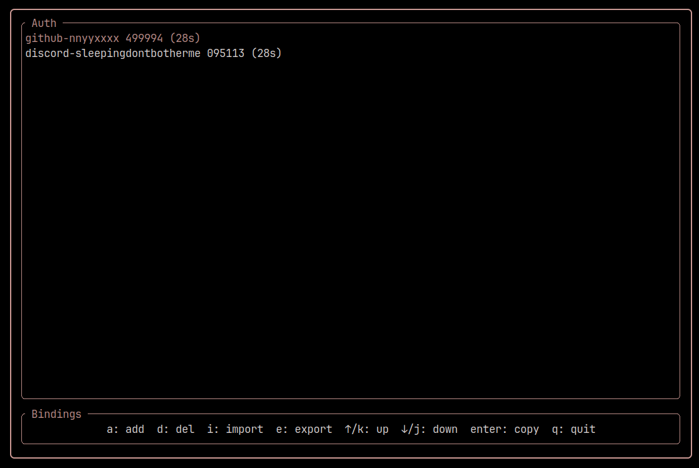

<div align="center">

# Auth



A simple terminal-based authenticator app written in Rust that generates TOTP codes.

</div>

## Security

> [!WARNING]
> TOTP secrets are stored unencrypted in `~/.local/share/auth/entries.toml`. This will be changed later in the future.

## Features

- Generate TOTP codes with remaining time
- Add/Delete entries
- Import/Export entries as TOML files
- Copy codes to clipboard (requires wl-copy or xclip, depending on your display server it is recommended that you only have 1 of these installed at a time)
- Terminal UI with keyboard controls

## Usage

### Controls

- `a`: Add new entry
- `E`: Edit selected entry
- `d`: Delete selected entry
- `i`: Import entries
- `e`: Export entries
- `↑/k`: Move selection up
- `↓/j`: Move selection down
- `Enter`: Copy code to clipboard
- `q`: Quit

### Building

```
cargo build --release
```

## License

Copyright (C) 2024 [Nyx](https://github.com/nnyyxxxx)

This program is free software; you can redistribute it and/or modify it under the terms of the GNU General Public License version 2 as published by the Free Software Foundation.

This program is distributed in the hope that it will be useful, but WITHOUT ANY WARRANTY; without even the implied warranty of MERCHANTABILITY or FITNESS FOR A PARTICULAR PURPOSE. See the GNU General Public License for more details.

You should have received a copy of the GNU General Public License along with this program; if not, write to the Free Software Foundation, Inc., 51 Franklin Street, Fifth Floor, Boston, MA 02110-1301, USA or see <https://www.gnu.org/licenses/old-licenses/gpl-2.0.txt>

The full license can be found in the [license](license) file.
